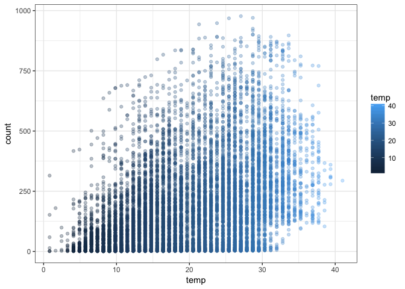
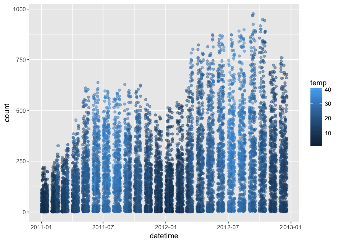
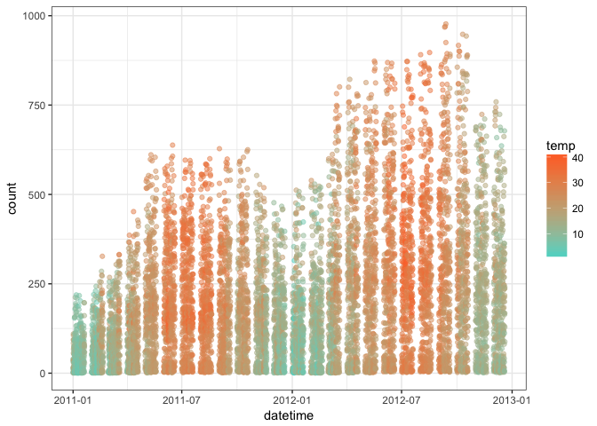
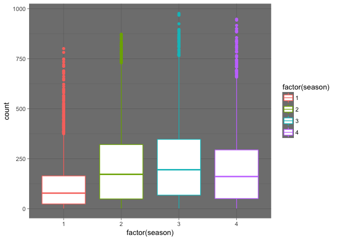
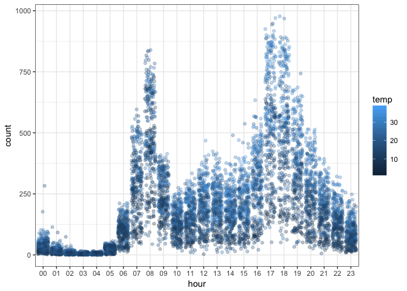
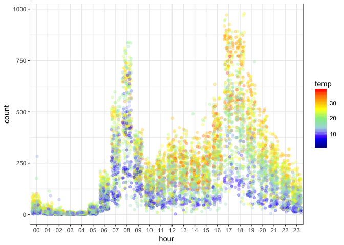
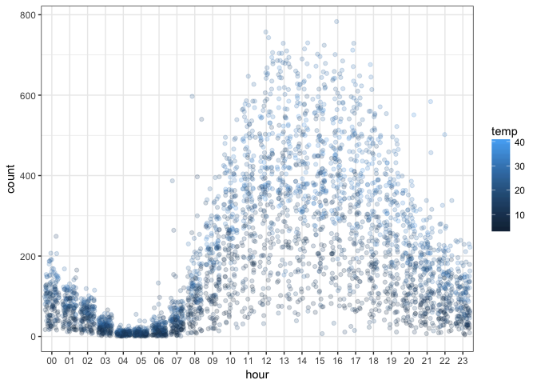
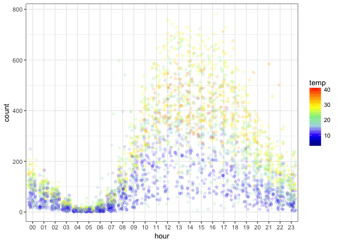

``` r
bike <- read.csv("bikeshare.csv")
```

Including Plots
---------------

You can also embed plots, for example:

``` r
head(bike)
```

    ##              datetime season holiday workingday weather temp  atemp
    ## 1 2011-01-01 00:00:00      1       0          0       1 9.84 14.395
    ## 2 2011-01-01 01:00:00      1       0          0       1 9.02 13.635
    ## 3 2011-01-01 02:00:00      1       0          0       1 9.02 13.635
    ## 4 2011-01-01 03:00:00      1       0          0       1 9.84 14.395
    ## 5 2011-01-01 04:00:00      1       0          0       1 9.84 14.395
    ## 6 2011-01-01 05:00:00      1       0          0       2 9.84 12.880
    ##   humidity windspeed casual registered count
    ## 1       81    0.0000      3         13    16
    ## 2       80    0.0000      8         32    40
    ## 3       80    0.0000      5         27    32
    ## 4       75    0.0000      3         10    13
    ## 5       75    0.0000      0          1     1
    ## 6       75    6.0032      0          1     1

Targed variable is count
========================

EDA
===

``` r
library(ggplot2)
ggplot(aes(temp, count), data = bike) + geom_point(alpha = .3, aes(color = temp)) + theme_bw()
```



Convert to time stamp
=====================

``` r
bike$datetime <- as.POSIXct(bike$datetime)
class(bike$datetime)
```

    ## [1] "POSIXct" "POSIXt"

``` r
p1 <- ggplot(aes(datetime, count), data = bike) + geom_point(aes(color = temp), alpha = 0.5)
p1
```



``` r
p1 + scale_color_continuous(low = '#55D8CE', high = '#FF6E2E') + theme_bw()
```



``` r
cor(bike$temp, bike$count)
```

    ## [1] 0.3944536

``` r
ggplot(aes(factor(season), count), data = bike) + geom_boxplot(aes(color = factor(season))) + theme_dark()
```



Feature Engineering, creating hour column
=========================================

``` r
bike$hour <- sapply(bike$datetime, function(x){format(x, "%H")})
head(bike)
```

    ##              datetime season holiday workingday weather temp  atemp
    ## 1 2011-01-01 00:00:00      1       0          0       1 9.84 14.395
    ## 2 2011-01-01 01:00:00      1       0          0       1 9.02 13.635
    ## 3 2011-01-01 02:00:00      1       0          0       1 9.02 13.635
    ## 4 2011-01-01 03:00:00      1       0          0       1 9.84 14.395
    ## 5 2011-01-01 04:00:00      1       0          0       1 9.84 14.395
    ## 6 2011-01-01 05:00:00      1       0          0       2 9.84 12.880
    ##   humidity windspeed casual registered count hour
    ## 1       81    0.0000      3         13    16   00
    ## 2       80    0.0000      8         32    40   01
    ## 3       80    0.0000      5         27    32   02
    ## 4       75    0.0000      3         10    13   03
    ## 5       75    0.0000      0          1     1   04
    ## 6       75    6.0032      0          1     1   05

Scatterplot
===========

``` r
library(dplyr)
```

    ## 
    ## Attaching package: 'dplyr'

    ## The following objects are masked from 'package:stats':
    ## 
    ##     filter, lag

    ## The following objects are masked from 'package:base':
    ## 
    ##     intersect, setdiff, setequal, union

``` r
# filter()= subset(), filter() only works with dplyr library 
p2 <- ggplot(aes(hour, count), data = filter(bike, workingday == 1)) + geom_point(aes(color = temp), alpha = .3, position = position_jitter(w= .4, h = 0)) + theme_bw()
p2
```



``` r
p2 <- p2 + scale_color_gradientn(colours = c('dark blue', 'blue', 'light blue', 'light green', 'yellow', 'orange', 'red'))
p2
```



``` r
p3 <- ggplot(aes(hour, count), data = filter(bike, workingday == 0)) + geom_point(aes(color = temp), alpha = .2, position = position_jitter(w= .4, h = 0)) + theme_bw()
p3
```



``` r
p3 <- p3 + scale_color_gradientn(colours = c('dark blue', 'blue', 'light blue', 'light green', 'yellow', 'orange', 'red'))
p3
```



Model Building
==============

This is time series data thats why cannot use all variables to predict count column. Just using temp column

``` r
temp.model <- lm(count ~ temp, bike)
```

``` r
summary(temp.model)
```

    ## 
    ## Call:
    ## lm(formula = count ~ temp, data = bike)
    ## 
    ## Residuals:
    ##     Min      1Q  Median      3Q     Max 
    ## -293.32 -112.36  -33.36   78.98  741.44 
    ## 
    ## Coefficients:
    ##             Estimate Std. Error t value Pr(>|t|)    
    ## (Intercept)   6.0462     4.4394   1.362    0.173    
    ## temp          9.1705     0.2048  44.783   <2e-16 ***
    ## ---
    ## Signif. codes:  0 '***' 0.001 '**' 0.01 '*' 0.05 '.' 0.1 ' ' 1
    ## 
    ## Residual standard error: 166.5 on 10884 degrees of freedom
    ## Multiple R-squared:  0.1556, Adjusted R-squared:  0.1555 
    ## F-statistic:  2006 on 1 and 10884 DF,  p-value: < 2.2e-16

How many bike rental counts at 25 c?
====================================

``` r
# One way of answering above question
mx_plus_c <- 9.1705*25 + 6.0462
mx_plus_c
```

    ## [1] 235.3087

``` r
# The othe way
temp.test <- data.frame(temp = c(25))
predict(temp.model, temp.test)
```

    ##        1 
    ## 235.3097

changing hour column to numeric
===============================

``` r
bike$hour <- sapply(bike$hour, as.numeric)
```

Another model
=============

``` r
# creating model except some columns
model <- lm(count ~ . -casual - registered - datetime - atemp, bike )
summary(model)
```

    ## 
    ## Call:
    ## lm(formula = count ~ . - casual - registered - datetime - atemp, 
    ##     data = bike)
    ## 
    ## Residuals:
    ##     Min      1Q  Median      3Q     Max 
    ## -324.61  -96.88  -31.01   55.27  688.83 
    ## 
    ## Coefficients:
    ##              Estimate Std. Error t value Pr(>|t|)    
    ## (Intercept)  46.91369    8.45147   5.551 2.91e-08 ***
    ## season       21.70333    1.35409  16.028  < 2e-16 ***
    ## holiday     -10.29914    8.79069  -1.172    0.241    
    ## workingday   -0.71781    3.14463  -0.228    0.819    
    ## weather      -3.20909    2.49731  -1.285    0.199    
    ## temp          7.01953    0.19135  36.684  < 2e-16 ***
    ## humidity     -2.21174    0.09083 -24.349  < 2e-16 ***
    ## windspeed     0.20271    0.18639   1.088    0.277    
    ## hour          7.61283    0.21688  35.102  < 2e-16 ***
    ## ---
    ## Signif. codes:  0 '***' 0.001 '**' 0.01 '*' 0.05 '.' 0.1 ' ' 1
    ## 
    ## Residual standard error: 147.8 on 10877 degrees of freedom
    ## Multiple R-squared:  0.3344, Adjusted R-squared:  0.3339 
    ## F-statistic:   683 on 8 and 10877 DF,  p-value: < 2.2e-16

This model woul not be so good to predict time series analysis.
